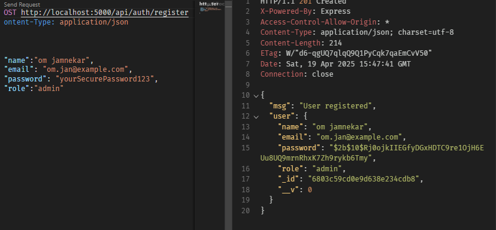
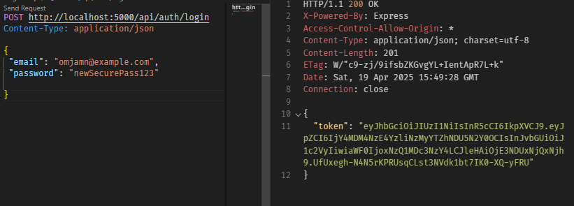
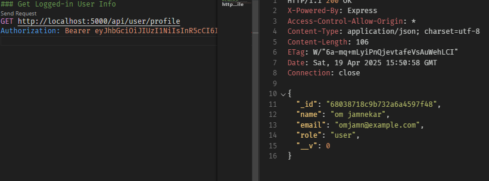
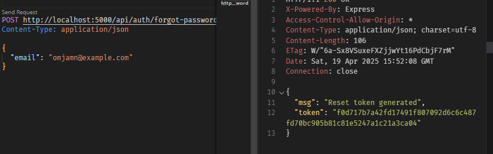
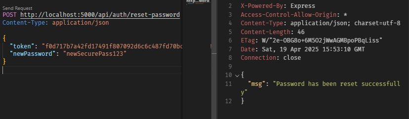

#  Node.js TypeScript Authentication API

A complete authentication backend built with **Node.js**, **Express**, **TypeScript**, **MongoDB**, and **JWT**, supporting:

- ✅ User Registration & Login
- 🔐 Role-based Access (Admin/User)
- 🔄 Password Reset via Token
- 🔍 Authenticated User Info Retrieval
- 🧪 HTTP Request Testing (with `.http` files)
- 🔧 Modular Folder Structure

---

##  Getting Started

### 1. Clone the Repo

```bash
git clone https://github.com/your-username/auth-api-ts.git
cd auth-api-ts
```

### 2. Install Dependencies

```bash
npm install
```

### 3. Set Up Environment Variables

Create a `.env` file in the root with the following:

```env
PORT=5000
MONGO_URI=your_mongodb_connection_string
JWT_SECRET=your_secret_key
```

---

##  Features Overview

###  Auth API

| Route | Method | Description |
|-------|--------|-------------|
| `/api/auth/register` | POST | Register new user |
| `/api/auth/login` | POST | Login & receive JWT |
| `/api/auth/admin` | GET | Admin-only route |
| `/api/auth/profile` | GET | Get logged-in user's profile |
| `/api/auth/forgot-password` | POST | Request password reset token |
| `/api/auth/reset-password` | POST | Reset password with token |

###  User API

| Route | Method | Description |
|-------|--------|-------------|
| `/api/user/profile` | GET | Get current user's data |

>  All protected routes require an `Authorization: Bearer <token>` header.
---

##  Project Structure

```
.
├── config/
│   └── db.ts             # MongoDB connection
├── controllers/
│   ├── auth.controller.ts
│   └── user.controller.ts
├── middleware/
│   └── auth.middleware.ts
├── models/
│   └── user.model.ts
├── routes/
│   ├── auth.routes.ts
│   └── user.routes.ts
├── .env
├── app.ts
├── server.ts
└── package.json
```

---

##  HTTP Test Files

Use the provided `.http` files with REST Client extension in VSCode:

- `register.http`
- `login.http`
- `admin.http`
- `profile.http`
- `forgot.http`
- `reset.http`
- `user.http`

---

##  API Request Previews

###  Register


###  Login


###  User


###  Forgot Password


###  Reset Password



##  Technologies Used


- **Node.js** + **Express**
- **TypeScript**
- **MongoDB** + **Mongoose**
- **JWT** for authentication
- **bcryptjs** for hashing passwords
- **crypto** for reset token
- **dotenv**, **cors**, etc.

---

##  Roles & Security

- Admin routes are protected by role checking middleware.
- Passwords are hashed before storing.
- JWTs expire in 1 day and are securely signed.
- Reset tokens expire in 1 hour.

---

##  Future Enhancements

- ✉️ Email integration for password reset tokens
- 📬 Admin user dashboard
- 📊 Token blacklisting (logout handling)
- 🌐 Deployment on Vercel / Render / Railway

---

##  Tip

You can generate JWT tokens with custom payloads using:

```ts
jwt.sign({ id: user._id, role: user.role }, JWT_SECRET, { expiresIn: "1d" });
```

---

##  Author

Made by **Om Jamnekar**

